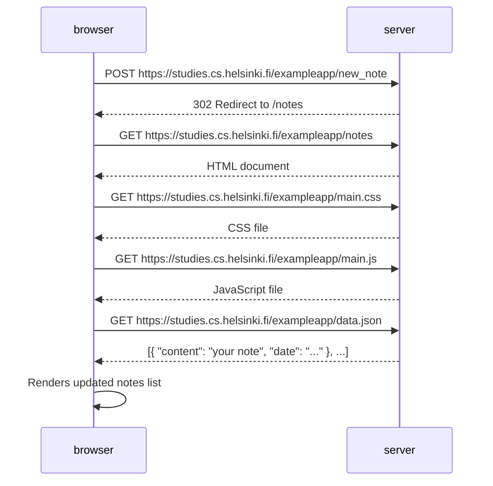

```mermaid
sequenceDiagram
    participant browser
    participant server

    browser->>server: POST https://studies.cs.helsinki.fi/exampleapp/new_note
    server-->>browser: 302 Redirect to /notes
    browser->>server: GET https://studies.cs.helsinki.fi/exampleapp/notes
    server-->>browser: HTML document
    browser->>server: GET https://studies.cs.helsinki.fi/exampleapp/main.css
    server-->>browser: CSS file
    browser->>server: GET https://studies.cs.helsinki.fi/exampleapp/main.js
    server-->>browser: JavaScript file
    browser->>server: GET https://studies.cs.helsinki.fi/exampleapp/data.json
    server-->>browser: [{ "content": "your note", "date": "..." }, ...]
    browser->>browser: Renders updated notes list
```