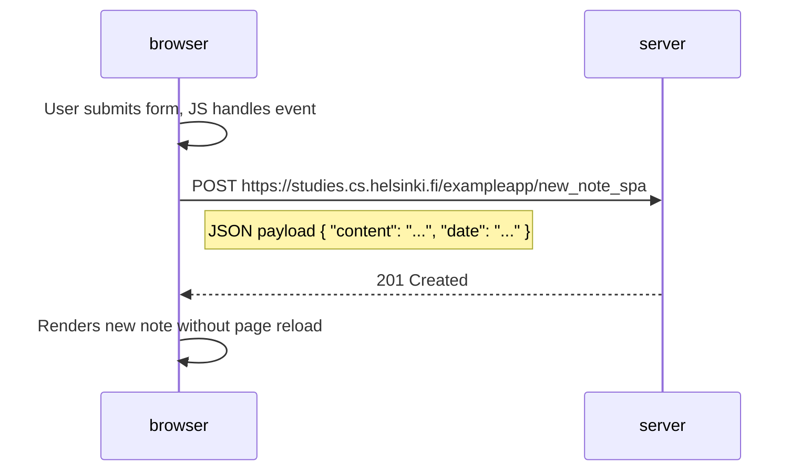

```mermaid
sequenceDiagram
    participant browser
    participant server

    browser->>browser: User submits form, JS handles event
    browser->>server: POST https://studies.cs.helsinki.fi/exampleapp/new_note_spa
    Note right of browser: JSON payload { "content": "...", "date": "..." }
    server-->>browser: 201 Created
    browser->>browser: Renders new note without page reload
```